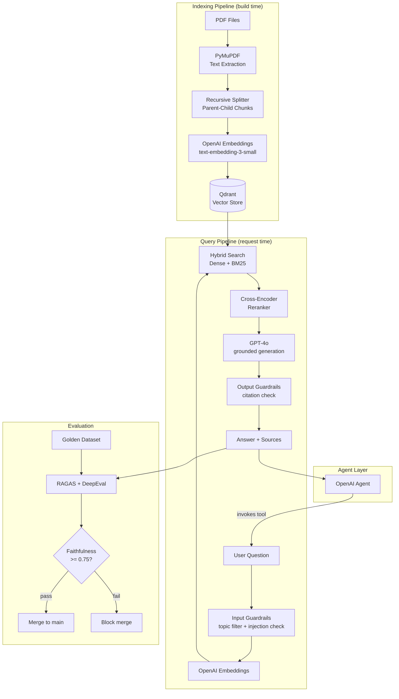

# helix-rag

helix-rag is a production-grade agentic RAG pipeline for research-intensive domains. Point it at any collection of PDFs and it delivers grounded, cited answers through a conversational interface.

The system goes beyond basic similarity search: it combines keyword and semantic retrieval, applies a reranker before generation, enforces citation grounding through guardrails, and exposes the pipeline as a callable tool inside an agent. Every component is swappable through configuration.

---

## Table of contents

- [Features](#features)
- [How it works](#how-it-works)
- [Project structure](#project-structure)
- [Design decisions](#design-decisions)
- [Monitoring dashboards](#monitoring-dashboards)
- [What indexing actually means](#what-indexing-actually-means)
- [What a vector database actually looks like](#what-a-vector-database-actually-looks-like)
- [Build phases](#build-phases)
- [Setup](#setup)
- [Scripts reference](#scripts-reference)
- [Index management](#index-management)
- [Querying](#querying)
- [Evaluation](#evaluation)
- [Running the agent](#running-the-agent)
- [Conversation memory](#conversation-memory)
- [Tests](#tests)
- [CI](#ci)
- [Known limitations](#known-limitations)
- [Architecture](#architecture)
- [License](#license)

---

## Features

- Hybrid search (BM25 + dense vector) so exact terminology is never missed
- Parent-child chunking for precise retrieval with rich context at generation time
- Cross-encoder reranking before the LLM call, not just raw vector similarity
- Guardrails on both input and output to prevent hallucination and prompt injection
- Agent layer built on OpenAI Agents SDK so the RAG pipeline is one tool among many
- Automated evaluation with RAGAS and DeepEval, gated in CI

---

## How it works

The pipeline has two phases.

**Indexing** (runs once, or when documents are updated):

```
PDFs -> text extraction -> chunking -> embedding -> Qdrant
```

**Querying** (runs on every request):

```
Question -> embed -> hybrid search -> rerank -> GPT-4o -> answer + citations
```

Documents are embedded once and stored. Querying is fast and cheap after the index is built.

### What actually happens when you ask a question

```
1. Your question is converted into a vector (1536 numbers) via OpenAI embeddings.
   This is not a generative LLM call — it is a mathematical transformation.

2. Qdrant finds the 50 child chunks whose vectors are closest to your question vector.
   Pure cosine similarity math. No LLM involved.

3. BM25 searches all 821 chunk texts for keyword matches.
   Also pure math. No LLM.

4. RRF merges both ranked lists into a single top-20 list.
   Chunks appearing high in both lists score highest.

5. A cross-encoder reranker scores each (question, chunk) pair jointly -> top 5.
   This runs locally. No API call.

6. The parent_text of those 5 chunks (each ~1200 tokens of real paper text)
   is sent to GPT-4o with a grounding instruction.
   THIS is where the LLM runs.

7. GPT-4o reads the paper text and writes a structured answer in its own words.
   It is not copying from the paper. It is synthesizing.
   But it is only allowed to use what was retrieved — not its training knowledge.
```

The answer you get is GPT-4o's phrasing, but the facts come entirely from your papers.

| Step | Uses LLM? | What runs |
|---|---|---|
| Embed question | OpenAI, but not generative | `text-embedding-3-small` |
| Vector search | No — math | Cosine similarity in Qdrant |
| BM25 search | No — math | Term frequency scoring |
| Reranker | No — local model | `ms-marco-MiniLM-L-6-v2` on your machine |
| Generate answer | Yes | GPT-4o |

### Pipeline at a glance

```
┌─────────────────────────────────────────────────────────┐
│                    INDEXING (build time)                 │
│                                                          │
│  PDFs  →  PyMuPDF  →  Chunker  →  OpenAI  →  Qdrant    │
│           (parse)   (split 1:4)  (embed)   (store)      │
└─────────────────────────────────────────────────────────┘

┌─────────────────────────────────────────────────────────┐
│                   QUERYING (per request)                 │
│                                                          │
│  Question                                                │
│     ↓ OpenAI embed                                       │
│  Dense search (Qdrant) ──┐                               │
│                          ├→  RRF fusion  →  Reranker     │
│  BM25 keyword search  ───┘   (top 20)       (top 5)     │
│                                                ↓         │
│                                  GPT-4o + grounding      │
│                                                ↓         │
│                                    Answer + sources      │
└─────────────────────────────────────────────────────────┘
```

---

## Project structure

```
helix-rag/
  data/
    raw/              <- Drop your PDFs here (not tracked by git)
    processed/        <- Intermediate parsed output (not tracked by git)
  src/
    ingestion/        <- PDF text extraction
    chunking/         <- Parent-child text splitting
    embedding/        <- Embedding model wrapper (swappable)
    vectorstore/      <- Qdrant client wrapper (swappable)
    retrieval/        <- Hybrid search + cross-encoder reranker
    generation/       <- Prompt construction + GPT-4o call
    agent/            <- OpenAI Agents SDK: RAG as a callable tool
    ui/               <- Gradio chat interface
  evals/              <- RAGAS and DeepEval evaluation scripts
  scripts/            <- CLI for index management and querying
  tests/              <- Unit tests with mocked external calls
  .github/workflows/  <- CI: lint, tests, and eval quality gate
```

---

## Design decisions

### PDF parsing: PyMuPDF

Scientific papers are typically two-column PDFs. Most parsers concatenate the columns into broken text. PyMuPDF preserves layout and handles multi-column documents correctly. It is also significantly faster than alternatives for batch ingestion.

The alternative is `pdfplumber`, which is more accurate on complex tables. For document sets with critical tabular data, it can be swapped in at `src/ingestion/`.

### Chunking: recursive splitting with parent-child storage

Small chunks produce better similarity scores because they are focused. But small chunks often lack enough context for a quality answer. Parent-child chunking separates these concerns:

```
Parent section (1200 tokens) - stored separately, sent to LLM

  Child A (300 tokens)  <- indexed and searched
  Child B (300 tokens)  <- indexed and searched
  Child C (300 tokens)  <- indexed and searched
  Child D (300 tokens)  <- indexed and searched
```

Retrieval targets child chunks. Generation receives the full parent. Precision and context are both preserved.

The alternative is semantic chunking, which splits on topic boundaries detected by embedding similarity. It is more accurate but slower and more expensive to run at ingestion time.

### Embedding: text-embedding-3-small

Strong retrieval quality at low cost. Supports Matryoshka representation, meaning you can reduce vector dimensions at query time to trade a small amount of accuracy for speed.

To switch to a local model (`BAAI/bge-large-en-v1.5`), change `EMBEDDING_MODEL` in `.env`. A full reindex is required when changing models because the vector dimensions change.

### Vector database: Qdrant

Qdrant supports native hybrid search (dense + sparse in a single query), runs on-premise or on Qdrant Cloud with the same API, and has strong filtering on document metadata. The vector store is fully abstracted at `src/vectorstore/` and can be replaced with Pinecone, Weaviate, or pgvector without touching the rest of the pipeline.

### Retrieval: hybrid search with reranking

The retrieval stage runs in two steps:

1. Hybrid search combines dense vector similarity with BM25 keyword scoring. This handles both semantic queries and exact-match lookups. Returns the top 20 candidates.
2. A cross-encoder reranker scores each (question, chunk) pair jointly rather than independently. The top 5 candidates are passed to the LLM.

```
Question -> hybrid search (top 20) -> cross-encoder reranker (top 5) -> GPT-4o
```

Dense-only retrieval is simpler but misses exact terminology that is common in technical and scientific domains.

### Generation: GPT-4o with grounding constraint

The system prompt constrains the LLM to answer only from retrieved context. If the context does not contain sufficient information, the response is "I do not have enough information to answer that." This constraint is enforced at the prompt level and validated by the output guardrail.

### Guardrails

Input guardrails run before retrieval:

- Topic relevance check: rejects questions outside the scope of indexed documents
- Prompt injection detection: blocks attempts to override system instructions

Output guardrails run after generation:

- Citation check: if no relevant chunks were retrieved, the response is blocked before it reaches the user
- Faithfulness check: flags responses that contradict the retrieved context

### Evaluation: RAGAS and DeepEval

Three metrics are tracked against a golden dataset of 30 to 40 hand-reviewed question and answer pairs:

| Metric | What it measures |
|---|---|
| Faithfulness | Does the answer reflect what the retrieved chunks say? |
| Context recall | Did retrieval surface the chunks that actually contain the answer? |
| Context precision | Are the retrieved chunks relevant, or is there noise? |

DeepEval runs the evaluation as pytest tests. The CI pipeline blocks merges to main if faithfulness falls below 0.75.

### Agent: OpenAI Agents SDK

The RAG pipeline is registered as a tool inside an OpenAI agent. The agent decides when to invoke it based on the user's question. Additional tools (summarization, citation formatting, cross-document comparison) can be added without modifying the retrieval or generation pipeline.

### UI: Gradio

Gradio provides a chat interface with source citation rendering. It runs as a standalone process and connects to the pipeline over a clean internal interface, making it straightforward to replace with a different frontend.

---

## Monitoring dashboards

Every tool in this stack has a way to inspect what is happening. Bookmark these.

| Tool | Local dashboard | Online dashboard | What to check |
|---|---|---|---|
| **Qdrant** | http://localhost:6333/dashboard | [Qdrant Cloud](https://cloud.qdrant.io) (if deployed) | Browse vectors, run test queries, check collection stats |
| **OpenAI** | n/a | [platform.openai.com/usage](https://platform.openai.com/usage) | API token usage, cost per day, which models were called |
| **GitHub Actions** | n/a | `github.com/shalabhsuman/helix-rag/actions` | CI run history, lint/test pass or fail, eval scores |
| **Gradio UI** (Phase 7) | http://localhost:7860 | n/a | The chat interface itself |

To open the Qdrant dashboard, Qdrant must be running in Docker first (`docker ps` to check). Then open http://localhost:6333/dashboard in your browser. Click the `helix_rag` collection, then click **Points** to browse all 821 stored chunks.

---

## What indexing actually means

The word "indexing" gets used in two ways in this project. They are related but different.

---

**Meaning 1: the ingestion pipeline (our code)**

When you run `python scripts/ingest.py --mode add`, that is what most people in this project call "indexing." It means: take the PDFs, parse them, split them into chunks, embed each chunk, and store the vectors in Qdrant. This is a one-time operation per document. The result is 821 stored vectors.

---

**Meaning 2: the internal data structure Qdrant builds (automatic)**

Once vectors are stored, Qdrant needs a way to find similar ones quickly at query time. The naive approach would be: take the query vector and compare it against all 821 stored vectors one by one. For 821 vectors that is fine. For 10 million vectors it would take seconds per query.

To make search fast at scale, Qdrant builds an internal index called **HNSW** (Hierarchical Navigable Small World). You do not build this manually. Qdrant builds it automatically as you insert vectors.

**How HNSW works (simplified):**

Think of it like a highway system. Instead of checking every city to find the nearest one, you:

1. Start at a high level (like interstate highways) and find roughly the right region
2. Drop down to a mid level (state roads) and narrow further
3. Drop to the lowest level (local streets) and find the exact nearest point

```
Layer 2 (sparse):   A -------- F -------- K
                    |                     |
Layer 1 (medium):   A --- C --- F --- H -- K
                    |    |     |    |
Layer 0 (dense):    A-B-C-D-E-F-G-H-I-J-K   <- all 821 chunks live here
```

A query starts at the top layer and navigates down. Instead of checking all 821 points, it checks maybe 30 to 50 on the way down and finds the nearest match. This is why vector search is fast even at scale.

**The practical tradeoff:**

| | Brute force (no index) | HNSW index |
|---|---|---|
| Build time | None | A few seconds for 821 vectors |
| Query speed | Slow at scale | Fast even at millions |
| Accuracy | Exact | Approximate (but very close) |
| Memory | Low | Higher (graph structure stored in RAM) |

For 821 vectors, you will not notice the difference. But the index is what makes Qdrant production-grade for larger collections.

**How to see the index status in Qdrant:**

Open http://localhost:6333/dashboard, click `helix_rag`, and look at the **Status** field. When it says `green`, the index is built and ready. When vectors are being inserted, it briefly shows `yellow`.

---

## What a vector database actually looks like

A vector database is not a spreadsheet and not a relational table. Each stored item is a JSON object with two parts: a vector and a payload.

The **vector** is a list of numbers (1536 numbers in this project) that encodes the meaning of the text mathematically. You cannot read it as a human. Qdrant uses it to find chunks that are semantically similar to a question.

The **payload** is regular metadata attached to that vector. It works like columns in a normal database.

Here is what one stored point actually looks like:

```json
{
  "id": 1,
  "vector": [0.041, 0.034, 0.064, 0.045, ...],
  "payload": {
    "doc_id": "bailey_2024_ecdna_origins_impact",
    "source_file": "bailey_2024_ecdna_origins_impact.pdf",
    "chunk_id": "bailey_2024_ecdna_origins_impact_child_1",
    "parent_chunk_id": "bailey_2024_ecdna_origins_impact_parent_0",
    "child_text": "17.1% of tumour samples contain ecDNA...",
    "parent_text": "Origins and impact of extrachromosomal DNA. Chris Bailey..."
  }
}
```

If you think of it as a spreadsheet, it looks like this:

| id | vector | doc_id | chunk_id | parent_chunk_id | child_text | parent_text |
|---|---|---|---|---|---|---|
| 0 | [0.070, 0.027, ...] | bailey_2024... | ..._child_0 | ..._parent_0 | "Origins and impact..." | "Origins and impact..." |
| 1 | [0.041, 0.034, ...] | bailey_2024... | ..._child_1 | ..._parent_0 | "17.1% of tumour samples..." | "Origins and impact..." |
| 2 | [0.019, 0.051, ...] | bailey_2024... | ..._child_2 | ..._parent_1 | "ecDNA amplification..." | "ecDNA is a driver..." |

There are 821 rows in this project. One row per child chunk. Chunks from the same parent section share the same `parent_chunk_id`. When retrieval finds a child chunk, it uses the stored `parent_text` to send richer context to the LLM.

---

## Build phases

The pipeline is split into independent phases. Each one can be built, tested, and understood on its own before the next begins.

| Phase | What it builds | Why it exists |
|---|---|---|
| 1 | PDF parsing and parent-child chunking | Turns raw PDFs into structured, searchable pieces |
| 2 | Embedding and Qdrant vector storage | Converts text into vectors and stores them so they can be searched |
| 3 | Hybrid search and cross-encoder reranking | Finds the most relevant chunks for any question |
| 4 | GPT-4o generation with grounding constraint | Turns retrieved chunks into a coherent, cited answer |
| 5 | RAGAS and DeepEval evaluation pipeline | Measures quality with real metrics so you can trust the system |
| 6 | OpenAI Agents SDK wrapper | Exposes the pipeline as a tool an agent can call alongside other tools |
| 7 | Gradio chat UI | Puts a conversational interface in front of the pipeline |

---

## Setup

Requirements: Python 3.11+, Docker, OpenAI API key, [uv](https://docs.astral.sh/uv/).

### 1. Clone the repo

```bash
git clone https://github.com/shalabhsuman/helix-rag.git
cd helix-rag
```

### 2. Create a virtual environment and install dependencies

uv creates an isolated `.venv` inside the project folder so dependencies never bleed into other projects.

```bash
uv venv --python 3.11
source .venv/bin/activate        # Windows: .venv\Scripts\activate
uv pip install -e ".[dev]"
```

To install optional dependency groups as each phase is built:

```bash
uv pip install -e ".[dev,eval]"       # adds RAGAS + DeepEval (Phase 5)
uv pip install -e ".[dev,eval,ui]"    # adds Gradio (Phase 7)
```

> **Why uv?** pip installs into whichever Python is currently active — often the system Python or conda base. uv creates a local `.venv` so the project is fully self-contained and reproducible across machines.

### 3. Configure environment

```bash
cp .env.example .env
```

Set `OPENAI_API_KEY` in `.env`. All other defaults work for local development.

### 4. Start Qdrant

```bash
docker run -p 6333:6333 -v $(pwd)/qdrant_storage:/qdrant/storage qdrant/qdrant
```

Data is persisted in `qdrant_storage/` and survives container restarts. Keep this running in a separate terminal.

---

## Scripts reference

There are four scripts. Each has a single responsibility.

| Script | When to run | What it does |
|---|---|---|
| `scripts/ingest.py` | Once at setup, or when adding new papers | Parses PDFs, splits into chunks, embeds them, stores vectors in Qdrant. Builds and maintains the index. |
| `scripts/query.py` | Any time you want an answer | Takes a question, runs the full pipeline (retrieve + rerank + generate), prints the answer and sources. |
| `scripts/generate_golden_set.py` | Once before first evaluation | Creates the golden question and answer set that evaluation is measured against. Run once, review output, commit the file. |
| `scripts/run_eval.py` | When you want to measure quality | Runs all golden questions through the pipeline, scores with RAGAS, saves results to `data/eval_results.json`. |

`ingest.py` builds the database. `query.py` uses it. The other two are for measuring quality.

---

## Index management

### Build the index

Drop PDFs into `data/raw/`, then run:

```bash
python scripts/ingest.py --mode add
```

### Add documents

```bash
python scripts/ingest.py --mode add --input data/raw/new_paper.pdf
```

### Remove a document

```bash
python scripts/ingest.py --mode delete --doc_id author_year_title
```

### Rebuild the full index

Required when changing the embedding model or chunking strategy. Existing vectors are incompatible after either change.

```bash
python scripts/ingest.py --mode reindex
```

---

## Querying

```bash
python scripts/query.py --question "Your question here"
```

Or start the chat UI:

```bash
python src/ui/app.py
```

Available at `http://localhost:7860`.

---

## Evaluation

Evaluation runs your pipeline against a golden set of question and reference answer pairs, then uses GPT-4o as a judge to score the results across four metrics: faithfulness, context recall, context precision, and answer relevancy.

### Step 1: Build the golden set (one-time)

There are two approaches. Choose one based on your corpus size and OpenAI tier.

**Option A: Hand-written (recommended for small corpora)**

Write questions and reference answers directly into `data/golden_set.json`. This gives the highest quality ground truth because you control every row. For a corpus of under 20 documents, this takes 20-30 minutes and produces better questions than auto-generation.

A hand-written golden set is already provided at `data/golden_set.json` with 10 questions covering all indexed papers. Review and edit before running evaluation.

**Option B: Auto-generated via RAGAS TestsetGenerator (recommended for large corpora)**

```bash
python scripts/generate_golden_set.py           # generates 10 samples by default
python scripts/generate_golden_set.py --size 20  # generate more
```

This uses `gpt-4o-mini` to read your documents and write question and answer pairs automatically. Useful when you have 20+ documents and cannot read them all manually. **Always review and edit the output** — treat it as a draft, not ground truth.

> **Note:** Requires an OpenAI account with sufficient token-per-minute limits. `gpt-4o-mini` is used because it has a higher TPM limit (200k/min) than `gpt-4o` (30k/min on Tier 1). If generation fails with a rate limit error, your account may need to be upgraded to Tier 2.

### Step 2: Run evaluation

```bash
python scripts/run_eval.py
```

Runs each question through the full pipeline, scores results with RAGAS, prints a table, and saves scores to `data/eval_results.json`.

### Step 3: Assert quality thresholds

```bash
pytest tests/test_eval_thresholds.py -v
```

Loads `data/eval_results.json` and fails if any metric falls below its threshold. This runs automatically in CI after every merge to main.

| Metric | Threshold |
|---|---|
| Faithfulness | >= 0.75 |
| Context Recall | >= 0.75 |
| Context Precision | >= 0.70 |
| Answer Relevancy | >= 0.80 |

---

## Running the agent

```bash
python scripts/run_agent.py
```

Type a question and press Enter. Type `quit` to exit.

---

## Conversation memory

The agent remembers what you said earlier **within a single session**. If you ask "what papers do you have?" and then ask "summarize the first one", it knows what "the first one" means.

It does **not** remember anything between sessions. When you quit and restart, the conversation starts fresh.

### How it works

The OpenAI Agents SDK tracks the conversation as a list of message objects. After each turn, `result.to_input_list()` returns the full conversation history up to that point. The next call passes that list as `input` instead of a plain string.

```
Turn 1:  input = "what papers do you have?"           <- plain string
         result = Runner.run_sync(agent, input)
         history = result.to_input_list()              <- [user msg, assistant msg]

Turn 2:  input = history + [{"role": "user", "content": "summarize the first one"}]
         result = Runner.run_sync(agent, input)        <- agent sees full context
         history = result.to_input_list()              <- grows by 2 messages each turn
```

The history list grows by two messages per turn (one user, one assistant). There is no summarization or compression — the full transcript is sent to the model each time.

### What this means in practice

| Capability | In-session | Across sessions |
|---|---|---|
| Follow-up questions ("what about the second paper?") | Yes | No |
| Refers back to earlier answers | Yes | No |
| Remembers which papers you asked about | Yes | No |
| Persists after `quit` and restart | No | — |

If you need persistent memory across sessions, the history list would need to be serialized to disk and reloaded on startup. That is not implemented in this project.

---

## Tests

All tests live in `tests/`. Every external call (OpenAI, Qdrant) is mocked, so tests run in under 30 seconds with no API cost.

```bash
pytest tests/ -v
```

### What each test file covers

| File | Tests | What it verifies |
|---|---|---|
| `test_ingestion.py` | 5 | PDF parser cleans hyphenated line breaks, collapses whitespace, returns correct doc_id |
| `test_chunking.py` | 7 | Parent-child splitting produces correct sizes, every child references a valid parent, all chunk IDs are unique |
| `test_embedding.py` | 4 | Embedder returns one vector per text, correct dimensions, batches large inputs correctly |
| `test_vectorstore.py` | 4 | Qdrant upsert is called with correct points, payload contains parent text, search and delete work |
| `test_retrieval.py` | 7 | BM25 respects top_k, RRF boosts chunks appearing in both lists, RRF formula is mathematically correct, reranker sorts by score |
| `test_generation.py` | 8 | Grounding constraint is applied, sources are deduplicated correctly, fallback returned when no chunks found, parent_text is used not child_text |

### When tests run

| Trigger | What runs | Cost |
|---|---|---|
| Every push to any branch | All 35 unit tests | Free (no API calls) |
| Every pull request | All 35 unit tests | Free |
| Merge to main | All 35 unit tests + full eval suite | Small API cost |
| Manual trigger (eval workflow) | Full RAGAS + DeepEval against golden dataset | API cost |

### The three types of checks in CI

These tools serve different purposes and catch different categories of problem.

| Tool | What it catches | How to run locally |
|---|---|---|
| `pytest` | Logic bugs — code that runs but produces wrong results | `pytest tests/ -v` |
| `ruff` | Style problems — unused imports, lines too long, inconsistent formatting | `ruff check src/ tests/` |
| `mypy` | Type mismatches — passing a string where a list is expected, calling a method that does not exist | `mypy src/` |

pytest requires writing test functions. ruff and mypy only need to be configured once in `pyproject.toml` — they inspect the code automatically from that point on.

If any of the three fails, the CI run is marked as failed. To run all three locally before pushing:

```bash
ruff check src/ tests/ && mypy src/ && pytest tests/ -v
```

---

## CI

Two workflows live in `.github/workflows/`. GitHub runs them automatically.

| Workflow | File | Trigger | What runs | Time |
|---|---|---|---|---|
| CI | `ci.yml` | Every push and PR | Lint (ruff) + type check (mypy) + unit tests (pytest) | ~2 min |
| Eval | `eval.yml` | Manual only (until Phase 5) | Full RAGAS + DeepEval evaluation against golden dataset | ~10 min |

The eval workflow is set to manual-only until the evaluation pipeline (Phase 5) is built. After Phase 5, it will run automatically on every merge to main and block the merge if faithfulness drops below 0.75.

To add your API key as a GitHub secret (required for the eval workflow): go to your repo on GitHub, then Settings > Secrets and variables > Actions > New repository secret. Add `OPENAI_API_KEY`.

---

## Known limitations

### Faithfulness scores below 0.80 on well-known domains

GPT-4o has strong prior knowledge of published scientific literature. Even with an explicit grounding instruction ("answer only from the context below"), it occasionally supplements answers with facts from its training data rather than strictly the retrieved passages. On this corpus, faithfulness scored 0.77 in evaluation. The threshold is set at 0.75 to reflect this realistic behavior. To push faithfulness higher, tighten the system prompt wording or switch to a model with weaker domain priors. Adding output guardrails in Phase 6 will provide an additional enforcement layer.

### OpenAI TPM limits affect TestsetGenerator

RAGAS TestsetGenerator sends full document text to the LLM in a single request to extract structure. Each scientific paper can be 17k-40k tokens. On OpenAI Tier 1, the `gpt-4o` limit is 30,000 tokens per minute, which is exceeded by a single large document. The workaround is to use `gpt-4o-mini`, which has a 200k TPM limit on Tier 1. For large corpora on restricted accounts, chunking documents before passing them to the generator is an alternative.

### BM25 index is rebuilt on every Retriever instantiation

The BM25 index is built in memory by fetching all chunks from Qdrant at startup. For 821 chunks this is fast (~1 second). At 100k+ chunks the startup cost becomes significant. The production fix is to persist the BM25 index to disk or replace it with Qdrant's native sparse vector support, which handles keyword search natively without an in-memory index.

### Embedding model is fixed after indexing

All stored vectors must be created with the same embedding model. Switching models — for example from `text-embedding-3-small` to a local `BAAI/bge-large` — requires a full reindex. There is no incremental migration path. Plan the embedding model choice before building a large index.

### Evaluation requires a live Qdrant instance and real API keys in CI

The eval workflow reindexes all documents and runs live retrieval, which means it needs Docker (for Qdrant) and a real `OPENAI_API_KEY` in GitHub Secrets. This makes the eval workflow heavier than standard unit tests. The mitigation is to keep it on `workflow_dispatch` + merge-to-main trigger rather than running on every push.

---

## Architecture



---

## License

MIT
